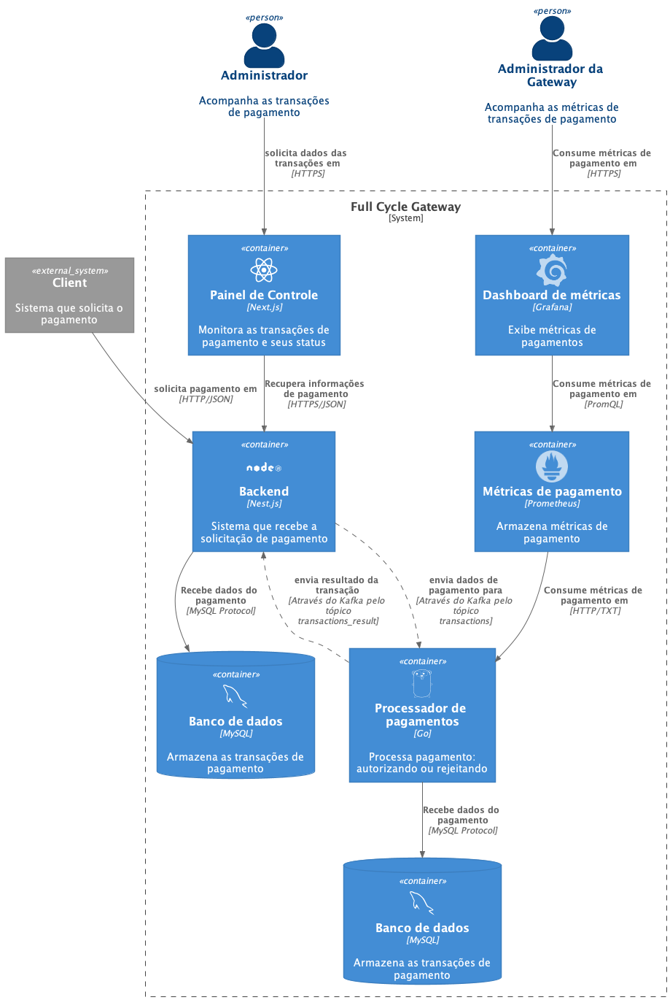

# Imersão Fullcycle 5 - Gateway de pagamento

## Sobre o repositório

Esse repositório contém todo código utilizado durante as imersão Full Cycle.

As instruções de instalações estão no README.md de cada projeto.

## Ordem recomendada de execução

* Apache Kafka
* Golang
* Back-end Nest.js
* Front-end Next.js

## Diagrama C4 da solução

